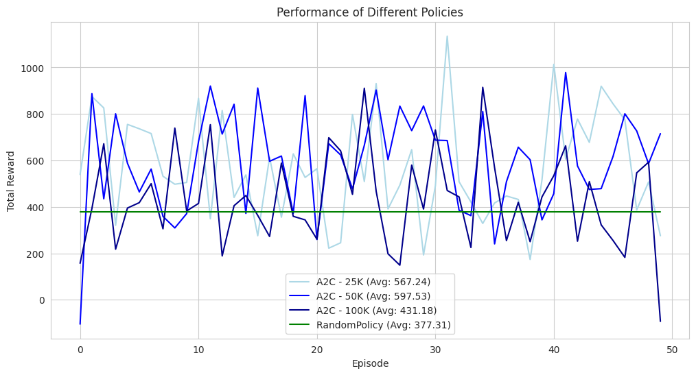
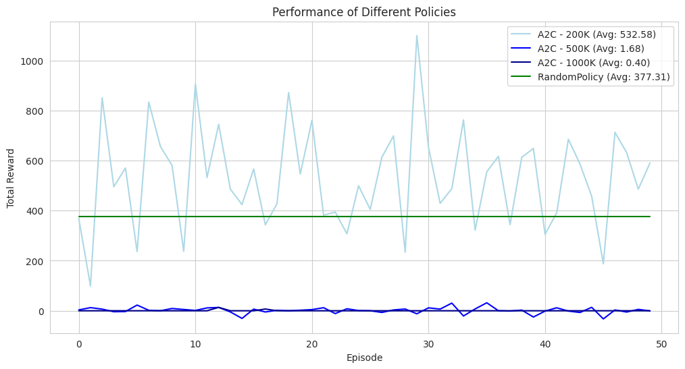
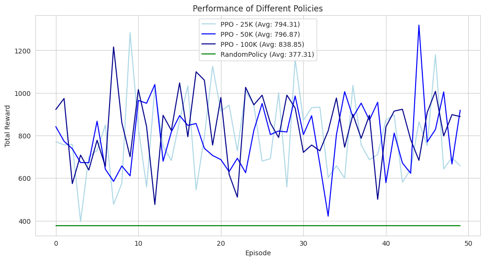
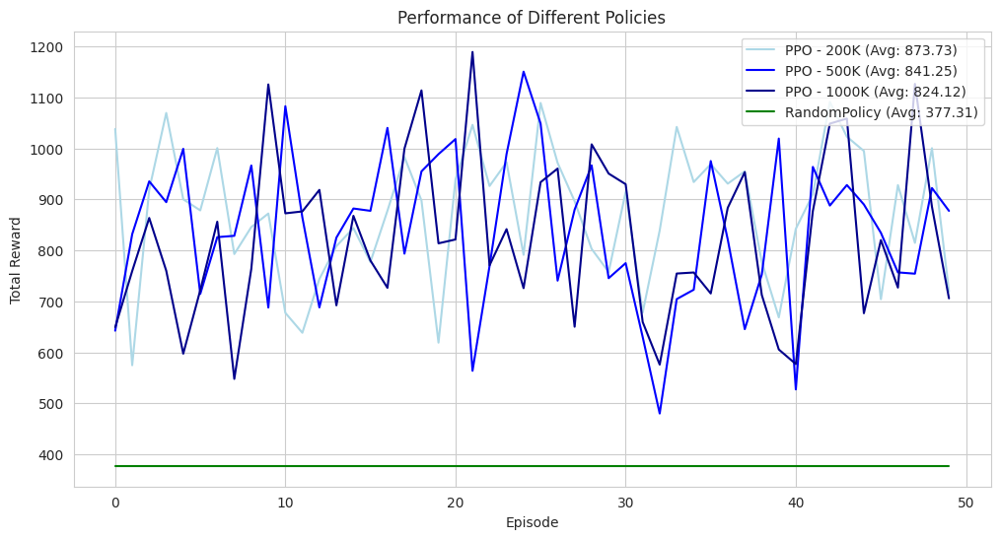
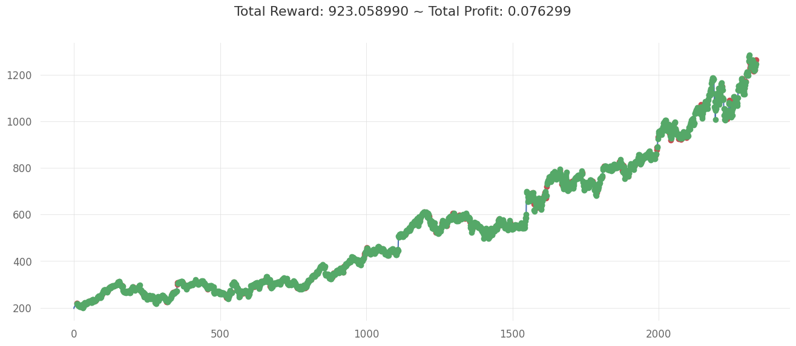

# ExchangeAgent

Training a stock exchange agent with Reinforcement Learning algorithms and Decision Transformer.

> Environment

- The environment used was the `gym-anytrading`, which can load stock exchange history as an OpenAI Gymnasium environment, and enable users to train their custom agents to trade stocks in the environment.
- The environment returns a window of stock exchange prices as the observation and allows for action `0` for selling the stocks and `1` for buying the stocks.

> Reinforcement Learning Algorithms

- The first set of agents was trained using A2C and PPO algorithms implemented in the `stable-baselines3` library.
- The agents were trained on each algorithm with 25K, 50K, 100K, 200K, 500K, and 1M timesteps.
- The best-performing agent was the PPO algorithm with 200K timesteps, which collects around ~900 avg. reward on an episode.

Performance Comparison between Models:

  
  

  
  

Sample Trading History (PPO-200K):

  

> Decision Transformer

- The decision transformer from the paper Decision Transformer: Reinforcement Learning via Sequence Modeling](https://arxiv.org/abs/2106.01345) was also trained on the collected trajectories from the PPO-200K model (offline RL policy).
- However, the decision transformer failed to converge, due to the small observation space of the time-series environment, as well as the model not converging easily on discrete action space.
